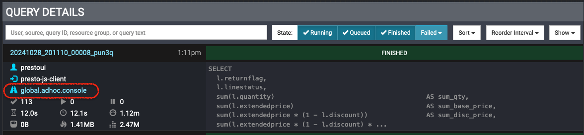
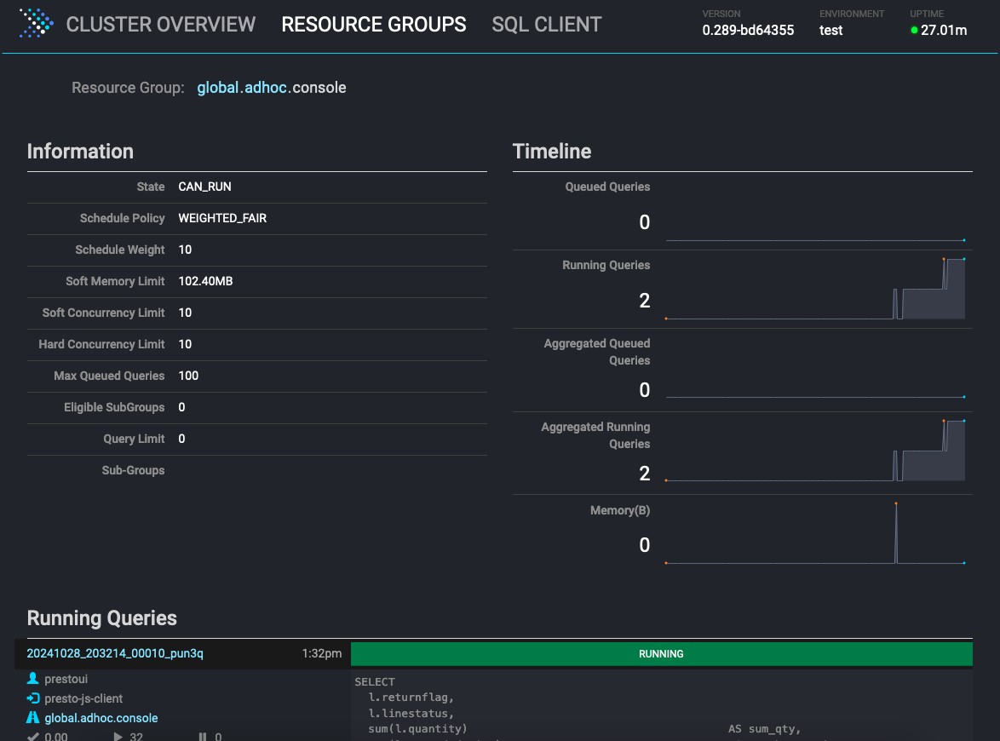

Presto Console - Resource Group

If you set up a Presto Cluster for multiple groups or users, you may configure the corresponding
`Resource Group` settings to arrange the CPU time, memory usage, and number of running queries
for different groups. If not, check the [documentation](https://prestodb.io/docs/current/admin/resource-groups.html)
for the details. To query the resource group statistics after the feature has been turned on,
you can access the REST API on the coordinator using the `/v1/resourceGroupState/` endpoint
to retrieve the resource group statistics. Another easier approach is to use the `RESOURCE GROUPS` page
on the Presto Console. On the top banner of the Presto Console, you can find the `RESOURCE GROUPS` page:

The link leads you to the `root` resource group and shows its statistics. Or you can click
on the resource group link of a query in the `Query Details` section on the `CLUSTER OVERVIEW` page:

The links in the `Query Details` section show the resource group's hierarchical structure. You can
click on the root node or leaf node of the resource group that the query belongs to. For example,
the query in the screenshot above belongs to the `console` subgroup under the `adhoc` subgroup.
And `adhoc` subgroup belongs to the `global` resource group. You can click on the individual node
to check the statistics of the subgroup. Here is an example of a subgroup's statistics:

You can use the `Resource Group` links at the top to navigate to the parent group. In the `Information`
section, you can check the real-time statistics, including `State`, `Schedule Policy`, `Schedule Weight`,
`Soft Memory Limit`, `Soft Concurrency Limit`, `Hard Concurrency Limit`, `Max Queued Queries`,
`Eligible SubGroups`, `Query Limit`, and `Sub-Groups`. [Here](https://prestodb.io/docs/current/admin/resource-groups.html#resource-group-properties)
are the details of each item. The `Timeline` section presents the historical statistics within 5 minutes.
At the very bottom, it lists current running queries if any.

The `Resource Groups` page provides an easier way to monitor and check the resource usage in different
resource groups on the cluster. You can know how many resources are used or any queuing queries in a resource group.
Then use this information to adjust the resource group configuration if needed and prevent resource exhaustion, meanwhile,
preserve enough resources for critical users or groups.

Be sure to check out the [documentation](https://prestodb.io/docs/current/admin/resource-groups.html) of the resource group,
set up file-based or database-based resource management, and use the `RESOURCE GROUPS` page to monitor the resource usage.
