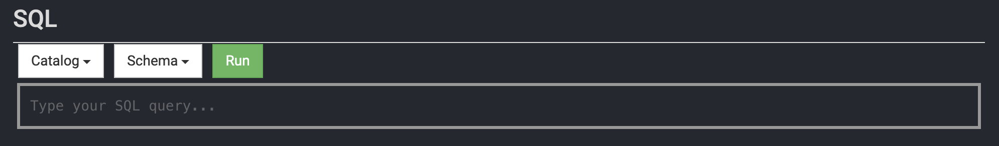
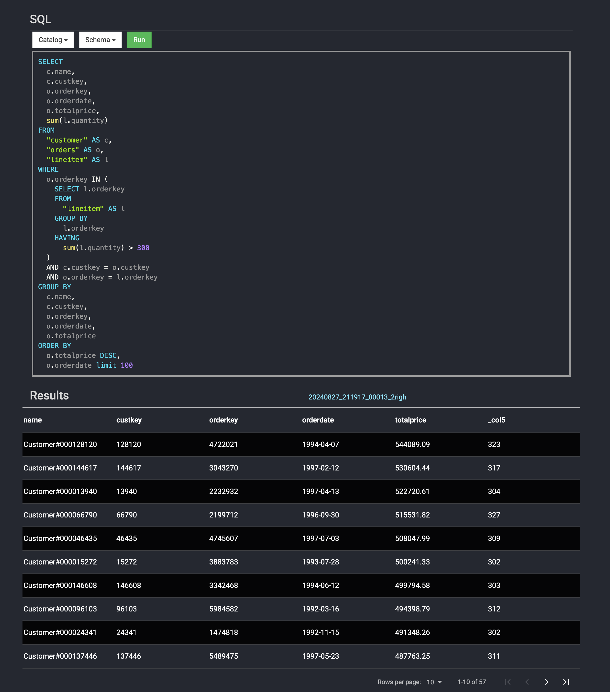
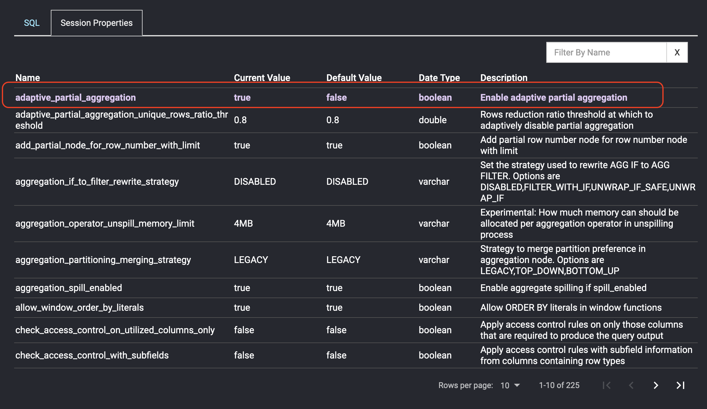

Presto Console - SQL Client on Web UI

The Presto command line interface (CLI) is one of the de facto tools for interacting with the Presto SQL engine.
To use it, you need to download the jar file and a Java runtime. You can find detailed information
[here](https://prestodb.io/docs/current/installation/cli.html). You're probably wondering: "Is there an easier
way to run SQL queries?". The answer is "YES"!  Thanks to the [Bhuma](https://www.bhuma.dev/) team
for contributing the [presto-js-client](https://github.com/prestodb/presto-js-client) to the Presto community.
The presto-js-client enables the capability to communicate with the Presto SQL engine using JavaScript, one of the
trending programming languages. To extend the benefits of the presto-js-client even further, the Presto Console was
introduced to the Presto UI in version 0.286. This allows you to execute SQL queries directly from a web browser.
Without further ado, let's explore the features provided by the Presto Console.

First thing first, open the Presto web UI on a browser and click on the `SQL Client` at the top banner to view the
UX of the Presto Console:

The UX of the Presto Console is quite simple and self-explanatory. There is a dismissible message box mentioning
how to set up the access controls and authorization policies to manage accessibility to the Presto Console. Please
follow the documentation to set up access controls and authorization policies based on your requirements. You can
close the message box by clicking the cross sign in the upper right corner. The main UX is comprised of two
dropdown lists, `Catalog` and `Schema`, a `Run` button, and a SQL input text area.

Use the `Catalog` and `Schema` drop-down lists to select the default catalog and schema for the SQL query. When you
select a catalog, the `Schema` drop-down list will show you the available schemas. Once the catalog and schema are
specified, they become the default values for the SQL query. To conserve the memory footprint used by the Presto
Console, a `SELECT` query will be limited to 100 returned records by appending `limit 100` to the end of your SQL when you click
the `Run` button. The query results are presented in a table view below the SQL input. Here is an example of running a
[TPCH query](https://github.com/prestodb/presto/blob/master/presto-benchto-benchmarks/src/main/resources/sql/presto/tpch/q18.sql):

Use the navigation bar at the bottom of the table to view the results. If you are interested in the query plan for the SQL query,
you can click the link at the top of the table to get detailed information.

In version 0.287, support for session properties has been added to the Presto Console. A new tab called "Session Properties"
has been created to display all session properties and to allow for modification if necessary. Simply click on the session
property and remember to hit the Enter key after typing in the new value. The session properties you changed will be
highlighted in a different color, like this:

Once you are done with the session properties, you can switch back to the `SQL` tab to type in and run the SQL query as usual.  

That's all about the Presto Console. Hope you like it and find it useful. If you'd like to see any features in
the Presto Console, feel free to open an issue at the [prestodb/presto](https://github.com/prestodb/presto) repository.

